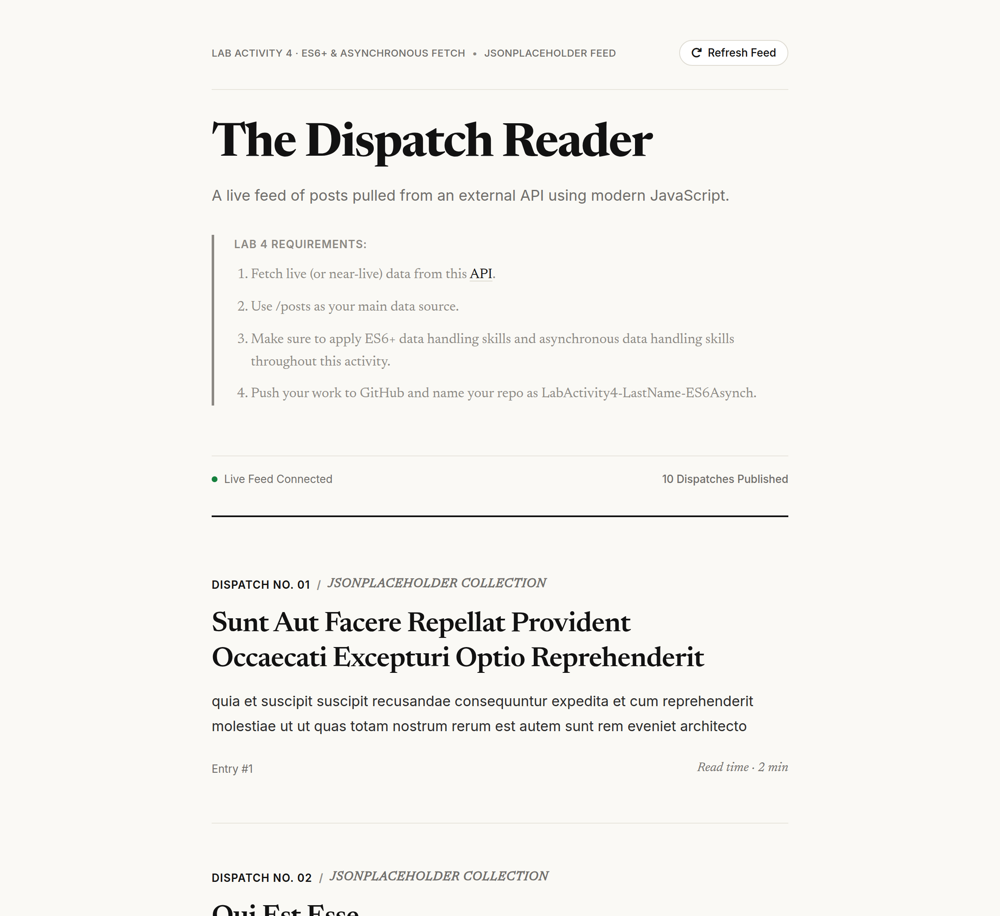
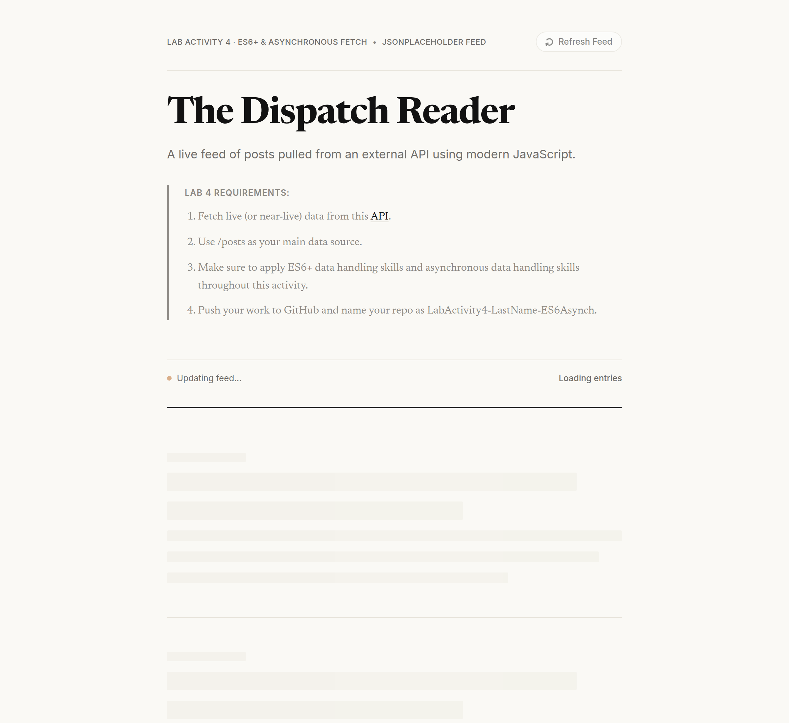
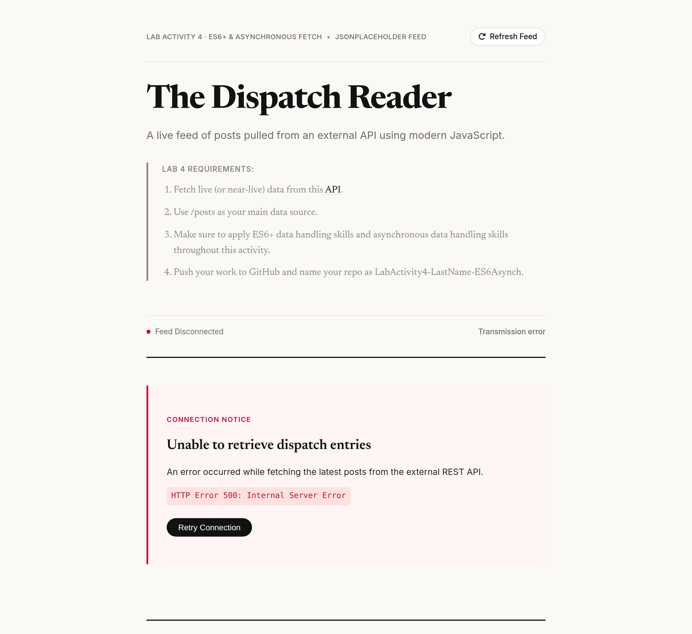

# Lab Activity 4: ES6+ & Asynchronous Fetch

A vanilla web app that fetches and displays posts from the JSONPlaceholder API, built to practice modern JavaScript.

## Application States

*   **Success State:** Displays the first 10 posts in a clean, editorial layout.
    
*   **Loading State:** Shows skeleton placeholders while data is being fetched.
    
*   **Error State:** Displays an error message and a retry button if the network request fails.
    

## Concepts Applied

*   **Fetch API & async/await:** Handles asynchronous data retrieval and explicitly checks HTTP status codes (`response.ok`).
*   **Array Methods:** Uses `.filter()` to limit the number of posts and `.map()` to generate the HTML blocks.
*   **ES6+ Syntax:** Implements arrow functions, object destructuring (`{ id, title, body }`), and template literals for dynamic HTML.
*   **Error Handling:** Wraps requests in `try...catch` blocks to manage failed network calls and update the UI accordingly.
